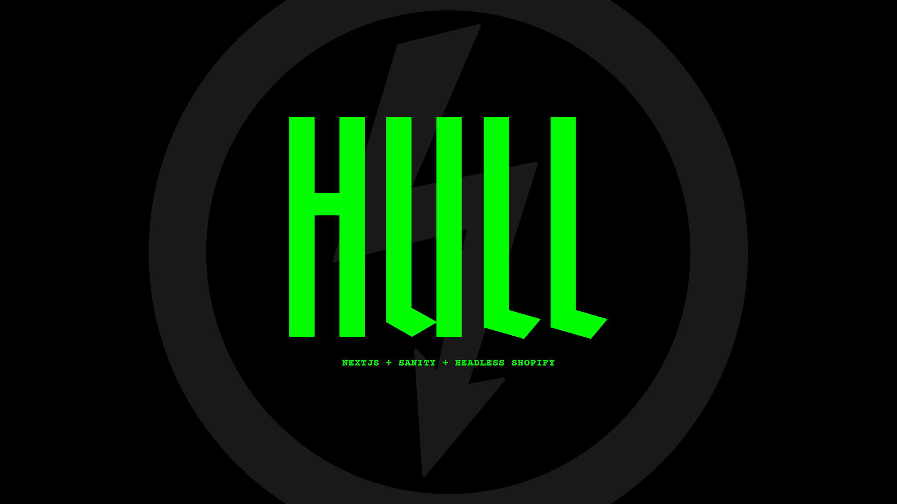

<p align="center">

</p>
<p align="center">
  <strong>Headless Shopify starter built on <a href="https://nextjs.org">Next.js</a></strong> 🤘 <br />
  <strong>Headless CMS powered by <a href="https://sanity.io">Sanity.io</a></strong><br />
</p>

<p align="center">
  <a href="#-features">Features</a> •
  <a href="#-set-up">Set Up</a> •
  <a href="#-spin-up">Spin Up</a> •
    <a href="#-deployment">Deployment</a> •
  <a href="#-extrastips">Extras</a> •
  <a href="#license">License</a>
</p>



# ✨ Features
🟢 **= implemented**&nbsp;&nbsp;/&nbsp;&nbsp;
🟡 **= in progress**&nbsp;&nbsp;/&nbsp;&nbsp;
⚪ **= not started**

---

- 🟢 Page Transitions powered by Framer Motion
- 🟢 Lazyload Images + WEBP format by default
- 🟢 Built-in Global navigation with active states and options for: internal links, external links, dropdowns, buttons
- 🟢 Mailchimp Newsletter form with opt-in feature, validation, and success/failure states
- 🟢 Contact Form with email notifications powered by SendGrid, validation, and success/failure states
- 🟢 Dynamic Page Routes with optional nesting (ie. /parent/child)
- 🟢 Automatic Sitemap.xml generation
- 🟢 Automatic robots.txt generation
- 🟢 301 Redirects pulled in from Sanity
- 🟢 Dynamic Modules for building page content, including:
   - 🟢 Marquees
   - 🟢 Image Carousels
   - 🟢 Accordions
   - 🟢 Pull-out Drawers
   - ⚪ One-off Card Grids
   - ⚪ Relationship Card Grids
- 🟢 Styles powered by PostCSS, to mimic SASS syntax
- 🟢 Baseline styles for all components, using a BEM-like approach
- 🟢 Simple Social icon navigation lists
- 🟡 Cursor Follow component
- ⚪ Initial animations
- ⚪ Scroll animations
- ⚪ Default Blog setup
- ⚪ Instagram module
- 🟢 Accessibility features:
   - 🟢 ARIA Landmark Roles
   - 🟢 Preserve default Focus States
   - 🟢 Correctly Trap focus when Drawers (like the Shop Cart) are open (w/ [focus-trap-react](https://www.npmjs.com/package/focus-trap-react))
   - 🟢 Correctly associated button states
   - 🟢 Required `alt` states for all images
   - 🟢 Skip to Content link
- 🟢 SEO features:
   - 🟢 Page-level SEO settings for meta descriptions and share graphics
   - 🟢 Fallback Global SEO settings
   - 🟢 Product Variant-specific SEO updates
   - 🟢 Automatic JSON-LD Schema markup for Products
   
### Headless Shopify
- 🟢 Syncs Products from Shopify into Sanity
- 🟢 Tracks product status from Shopify to help control visibility while editing
- 🟢 Automatic Variant option toggles
- 🟢 Marks deleted products and variants for easy tracking
- 🟢 Updates the URL on variant changes while keep a clean history stack
- 🟢 Accessible and clamped Quantity Counters
- 🟢 Vanity Shop URL Masking
- 🟢 Global Cart with access to all variant data for line items
- 🟢 Supports Single Variant products out of the box
- 🟢 PDP Photo Galleries with variant granularity
- 🟡 default PLP for all products
- 🟡 Custom PLPs with easy, Sanity-managed Collections
- ⚪ Sanity-managed conditional Cart "add-ons"
- ⚪ Ability to apply coupons to the checkout cart
- ⚪ Account Management (register/login/password/orders)
- ⚪ Customer Reviews Integration (Yotpo? Okendo? Junip?)
   
# 💀 Set Up

1. Clone this repository from your GitHub account with the `use template` button
2. Clone your repo locally

### 1) Sanity
1. `npm install && sanity init` in the `/studio` folder
2. During Sanity's initalization it will warn you, type `Y` and hit `enter`:
```
? The current folder contains a configured Sanity studio. Would you like to reconfigure it? (Y/n)
```
3. When it asks you what dataset configuration to use, go with the `default`
4. Add CORS Origins to your newly created Sanity project (visit: [manage.sanity.io](https://manage.sanity.io) and go to Settings > API):
    - Add your Studio URLs **_with_** credentials: `http://localhost:3333` and `[subdomain].sanity.studio`
    - Add your Front-end URLs **_without_** credentials: `http://localhost:3000` and `https://[subdomain].vercel.app`
    
### 3) Shopify Storefront Access
1. Enable Private Apps in Shopify
   - Apps > "Manage Private Apps" *(text link in page footer)*
   - Enable Private Apps
2. Create new Private App
   - Apps > Manage Private Apps > "Create private app" 
   - Give this a relevant name, I prefer: "Headless Storefront", so it's clear what it's being used for
   - Use your dev email to know when there are issues
   - Change Admin API permissions on "Products" to `Read and write`
   - Allow this app to access your storefront data using the Storefront API, with at least the following permissions:
      - Read inventory of products and their variants
      - Read and modify checkouts

### 4) Shopify Webhooks
1. Go to "Settings" *(bottom left)* -> "Notifications" -> "Webhooks" *(very bottom)*
2. add the following webhooks:
  - product update - `[your-domain]/api/shopify/product-update`
  - product deletion - `[your-domain]/api/shopify/product-delete`
> ⚠️ **Note** <br />You have to use a real domain name (no localhost). Be sure to use your Vercel project URL during development, and then switch to the production domain once live. You won't know your Vercel project domain until you deploy in a later step, just enter in what you think it will be for now!

### 2) NextJS (frontend)
2. `npm install` in the project root folder on local
3. Create an `.env.local` file in the project folder, and add the following variables:
```
SANITY_PROJECT_DATASET=production
SANITY_PROJECT_ID=XXXXXX
SANITY_API_TOKEN=XXXXXX
SHOPIFY_STORE_ID=XXXXXX
SHOPIFY_API_TOKEN=XXXXXX
SHOPIFY_API_PASSWORD=XXXXXX
SHOPIFY_WEBHOOK_INTEGRITY=XXXXXX
```
4. Update all the `XXXXXX` values, here's where to find each:
  - `SANITY_PROJECT_ID` - You can grab this after you've initalized Sanity, either from the `studio/sanity.json` file, or from your Sanity Manage dashboard
  - `SANITY_API_TOKEN` - Generate an API token for your Sanity project. Access your project from the Sanity Manage dashboard, and navigate to: "Settings" -> "API" -> "Add New Token" button. Make sure you give `read + write` access!
  - `SHOPIFY_STORE_ID` - This is your Shopify store ID, it's the subdomain behind `.myshopify.com`
  - `SHOPIFY_API_TOKEN` - Copy the Storefront Access Token you copied from setting up your Private Shopify App. _(Note: This is **not** the Admin API Key, scroll to the bottom where it says "Storefront API" for the correct value)_
  - `SHOPIFY_API_PASSWORD` - Copy the Admin API password from "Apps" -> "Manage private apps" -> [your_private_app].
  - `SHOPIFY_WEBHOOK_INTEGRITY` - Copy the Integrity hash from "Settings" -> "Notifications" -> "Webhooks" *(very bottom of page)*
  
### 5) Shopify Store Theme
Since we're serving our store through a headless environment, we don't want visitors accessing our unused shopify theme. The domain for this is visible during checkout, and is publicly accessible. To silence it, replace your current theme's `theme.liquid` file with the one from this repo, and replace `your_frontsite_domain` with your actual frontsite domain URL **(do not include protocol or trailing slash)**

This will essentially "pass-through" URLs accessed on at your Shopify Store to your true headless environment *(ie. `shop.666.com/products` -> `666.com/products`)*


# ⚡ Spin Up

### Frontend
`npm run dev` in the project folder to start the frontend locally
   - Your Frontend should be running on [http://localhost:3000](http://localhost:3000)
   
### Sanity
`sanity start` in the `/studio` folder to start the studio locally
   - Your Sanity Studio should be running on [http://localhost:3333](http://localhost:3333)
> ⚠️ **Note** <br />For all your singleton docs, you must comment out the `__experimental_actions` line for their corresponding schema after a fresh install in order to make changes. Once you publish the initial singleton, you should uncomment the `__experimental_actions` line to return it to a true "singleton".


# 🚀 Deployment

### Frontend
This is setup to work seamlessly with Vercel, which I highly recommend as your hosting provider of choice. Simply follow the on-screen instructions to setup your new project, and be sure to **add the same `.env.local` variables to your Vercel Project**

### Sanity
This is an easy one, you can simply run `sanity deploy` from the `/studio` folder in your project. Select a subdomain you want, and your Studio is now accessible from the web. This is where I'll invite the client to manage the project, so they can both add billing info and begin editing content.


# 🤘 Extras/Tips

#### Error: Failed to communicate with the Sanity API
If you get this error in your CLI, you need to logout and log back in again, unfortunately. Simply do `sanity logout` and then `sanity login` to fix.

#### Access your `product_sync` metafields in Shopify without using a plugin
Simply navigate to: `https://[store_id].myshopify.com/admin/bulk?resource_name=Product&edit=metafields.sanity.product_sync`

#### How do I properly hand-off a Vercel project to the client?
While not as easy as Netlify, what I prefer to do is:
1. have the client create their own Vercel account
2. At the time of writing, Github connections can only be connected to one Vercel account at a time, so I have the client create a Github account if they don't already have one, and transfer the project repo to them
3. Delete my dev project from my own Vercel account (this is so the client can utilize the project name and domain you were using during dev)
4. You or the client can now connect their newly transferred Github repo to their own Vercel account!


# Shoutouts
Big ups to the following rad folks who helped in big and small ways, both directly with various functionality and my (in)sane questions and frustrations with putting something like this together.
- 🔥 [@tuckercs](https://github.com/tuckercs)
- 🍝 [@iamkevingreen](https://github.com/iamkevingreen)
- 🧈 [@mikehwagz](https://github.com/mikehwagz)
- 😎 [@dictions](https://github.com/dictions)

# License

### MIT
> [nickdimatteo.com](https://nickdimatteo.com) &nbsp;&middot;&nbsp;
> Github [@ndimatteo](https://github.com/ndimatteo) &nbsp;&middot;&nbsp;
> Instagram [@ndimatteo](https://instagram.com/ndimatteo)
